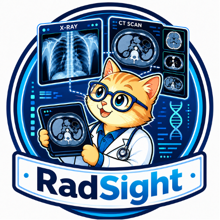
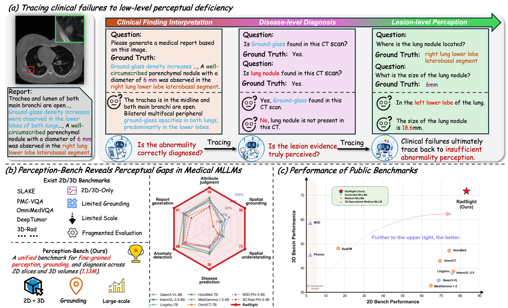
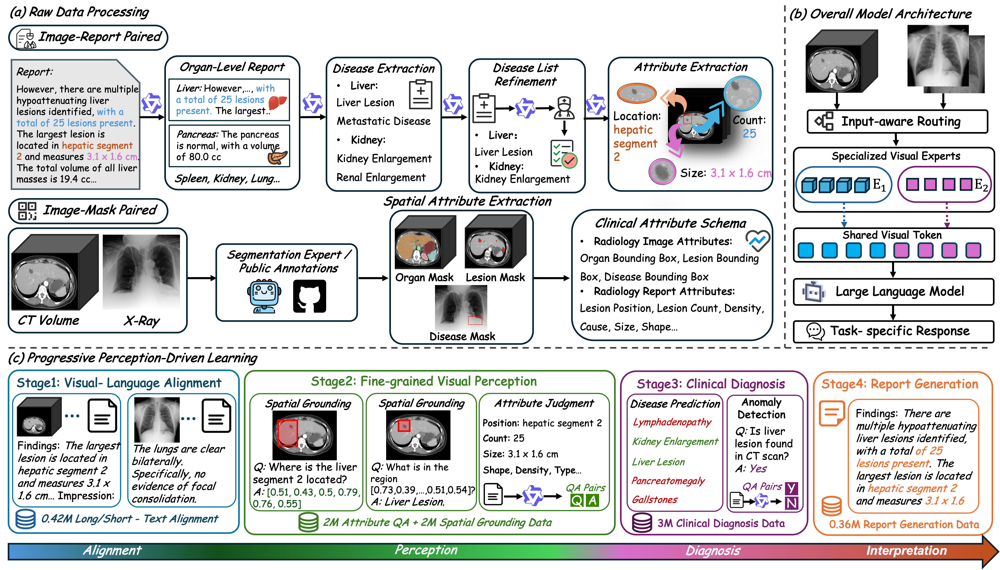

# RadSight

<p align="center">
  
</p>

<p align="center">
  <a href="https://arxiv.org/pdf/2607.22293v1"></a>
  <a href="https://huggingface.co/unstoppableljq/RadSight-4B"></a>
  <a href="https://huggingface.co/unstoppableljq/RadSight-8B"></a>
  <a href="https://github.com/alibaba-damo-academy/damo-RadSight"></a>
  <a href="https://github.com/alibaba-damo-academy/damo-RadSight/blob/main/LICENSE"></a>
</p>


<p align="center">
  <b>RadSight: Towards Perceptually Reliable Multimodal Radiology Image Understanding</b>
</p>

<p align="center">
  Jianqin Liu<sup>* 1, 2, 3</sup>&nbsp;&nbsp;
  Weiwei Cao<sup>* 1, 2</sup>&nbsp;&nbsp;
  Wanxing Chang<sup>* 1, 2</sup>&nbsp;&nbsp;
  Ruifeng Yuan<sup>* 1, 2</sup>&nbsp;&nbsp;
  Bowen Shi<sup>* 1, 2</sup>&nbsp;&nbsp;
  <br>
  Zhilin Zheng<sup>1, 2</sup>&nbsp;&nbsp;
  Xianjie Zhang<sup>1, 2</sup>&nbsp;&nbsp;
  Ling Zhang<sup>1</sup>&nbsp;&nbsp;
  Peng Wang<sup>&dagger; 3</sup>&nbsp;&nbsp;
  Jianpeng Zhang<sup>&dagger; 1, 2</sup>
</p>

<p align="center">
  <sup>1</sup> DAMO Academy, Alibaba Group&nbsp;&nbsp;
  <sup>2</sup> Hupan Lab&nbsp;&nbsp;
  <sup>3</sup> University of Electronic Science and Technology of China
  <br>
  <sup>*</sup> Equal contribution&nbsp;&nbsp;
  <sup>&dagger;</sup> Corresponding author (Email: jianpeng.zhang0@gmail.com)
</p>

**RadSight** is a medical multimodal large language model that supports both **2D medical images** (X-ray, CT slices, etc.) and **3D medical volumes** (CT/MRI in NIfTI format). It performs disease detection, anomaly finding, and medical report generation through visual question answering (VQA).

## Overview

<p align="center">
  
</p>

## Installation

### 1. Clone the repository

```bash
git clone https://github.com/alibaba-damo-academy/damo-RadSight.git
cd damo-RadSight
```

### 2. Create conda environment

```bash
conda create -n radsight python=3.10 -y
conda activate radsight
```

### 3. Install PyTorch

Install PyTorch with CUDA support (requires CUDA >= 12.0):

```bash
pip install torch==2.7.0 torchvision==0.22.0 --index-url https://download.pytorch.org/whl/cu124
```

### 4. Install dependencies

```bash
pip install -r requirements.txt
```

### 5. Install Flash Attention 2

Flash Attention 2 is **required** for both training and inference:

```bash
pip install flash-attn --no-build-isolation
```

> **Note:** Building flash-attn requires `nvcc` and may take several minutes. Make sure your CUDA toolkit version matches your PyTorch CUDA version.

## Model Weights

Download the pretrained model weights from HuggingFace:

| Model | Size | Link |
|-------|------|------|
| RadSight-4B | 4B | [HuggingFace](https://huggingface.co/unstoppableljq/RadSight-4B) |
| RadSight-8B | 8B | [HuggingFace](https://huggingface.co/unstoppableljq/RadSight-8B) |

```bash
# Using huggingface-cli
huggingface-cli download unstoppableljq/RadSight-4B --local-dir ./weights/RadSight-4B
```

> **Important:** After downloading the model weights, update the `"vision_encoder"` field in the model's `config.json` to point to your local SigLIP-NaViT path. Otherwise, the image processor will attempt to download it from the network during model loading.
> ```json
> // config.json
> "vision_encoder": "./path/to/local/SigLIP-NaViT"
> ```

### Pretrained Vision Encoders

| Encoder | Description | Link |
|---------|-------------|------|
| SigLIP-NaViT | 2D Vision Encoder | [HuggingFace](https://huggingface.co/DAMO-NLP-SG/VL3-SigLIP-NaViT) |
| RadSight-3D-Encoder | 3D Vision Encoder (nnUNet-based) | [HuggingFace](https://huggingface.co/radar-generalist/RADAR) |

## Quick Start

### 2D Medical Image Inference

```python
import sys, os, torch
sys.path.append(os.path.join(os.path.dirname(__file__), '..'))
from radsight.model import load_pretrained_model
from radsight.mm_utils import load_images, get_model_name_from_path
from radsight.model.processor import RadSightProcessor

# Load model
model_path = "path/to/RadSight_Weights"
model_name = get_model_name_from_path(model_path)
tokenizer, model, image_processor, context_len = load_pretrained_model(
    model_path, None, model_name, device_map={"": "cuda:0"}
)
processor = RadSightProcessor(image_processor, tokenizer)
model.config.use_token_compression = False

# Load 2D image (X-ray, CT slice, etc.)
images = load_images("path/to/your/xray.jpg")

conversation = [
    {
        "role": "user",
        "content": [
            {"type": "image"},
            {"type": "text", "text": "Please generate a medical report based on this image."},
        ]
    }
]

# Inference
modal = "image"
inputs = processor(
    images=[images],
    text=conversation,
    merge_size=1,
    modal="image",
    return_tensors="pt",
)
inputs = {k: v.cuda() if isinstance(v, torch.Tensor) else v for k, v in inputs.items()}
if "pixel_values" in inputs:
    inputs["pixel_values"] = inputs["pixel_values"].to(torch.bfloat16)

with torch.inference_mode():
    output_ids = model.generate(
        **inputs,
        do_sample=False,
        modals=[modal],
        max_new_tokens=8192,
        use_cache=True,
        pad_token_id=tokenizer.eos_token_id,
    )

output = tokenizer.batch_decode(output_ids, skip_special_tokens=True)[0].strip()
print(output)
```

### 3D Medical Volume Inference

```python
import sys, os, torch
sys.path.append(os.path.join(os.path.dirname(__file__), '..'))
from radsight.model import load_pretrained_model
from radsight.mm_utils import load_images, get_model_name_from_path, load_3D
from radsight.model.processor import RadSightProcessor

# Load model
model_path = "path/to/RadSight_Weights"
model_name = get_model_name_from_path(model_path)
tokenizer, model, image_processor, context_len = load_pretrained_model(
    model_path, None, model_name, device_map={"": "cuda:0"}
)
processor = RadSightProcessor(image_processor, tokenizer)
model.config.use_token_compression = False

# Load 3D volume (CT/MRI in NIfTI format)
volume = load_3D("path/to/your/ct_scan.nii.gz")
volume_data = volume["image"]

conversation = [
    {
        "role": "user",
        "content": [
            {"type": "video", "num_frames": 12},
            {"type": "text", "text": "Please generate a medical report based on this CT scan."},
        ]
    }
]

# Inference
modal = "volume"
inputs = processor(
    images=[volume_data],
    text=conversation,
    merge_size=1,
    modal="volume",
    return_tensors="pt",
)
inputs = {k: v.cuda() if isinstance(v, torch.Tensor) else v for k, v in inputs.items()}
if "pixel_values" in inputs:
    inputs["pixel_values"] = inputs["pixel_values"].to(torch.bfloat16)

with torch.inference_mode():
    output_ids = model.generate(
        **inputs,
        do_sample=False,
        modals=[modal],
        max_new_tokens=8192,
        use_cache=True,
        pad_token_id=tokenizer.eos_token_id,
    )

output = tokenizer.batch_decode(output_ids, skip_special_tokens=True)[0].strip()
print(output)
```

You can also run the inference script directly:

```bash
python scripts/eval/infer.py
```

## Data Processing

<p align="center">
  
</p>

See [data_process/README.md](data_process/README.md) for detailed instructions on preprocessing 3D medical volumes.

## Data Format

Training data is in JSON/JSONL format. Each sample follows this structure:

**2D Image sample:**
```json
{
  "id": 0,
  "image": "path/to/image.jpg",
  "conversations": [
    {"from": "human", "value": "<image>\nIs pneumonia found in the image?"},
    {"from": "gpt", "value": "Yes, there are signs of pneumonia in the lower left lobe."}
  ]
}
```

**3D Volume sample:**
```json
{
  "id": 1,
  "volume": ["path/to/volume.nii.gz"],
  "conversations": [
    {"from": "human", "value": "<volume>\nPlease describe the findings in this CT scan."},
    {"from": "gpt", "value": "The CT scan shows..."}
  ]
}
```

## Training

RadSight uses a **progressive multi-stage training** strategy:

| Stage | Purpose | Trainable Components | Frozen |
|-------|---------|---------------------|--------|
| Stage 1 | Vision-language alignment | 2D/3D Encoders + Projectors | LLM |
| Stage 2 | Low-level feature learning | All | — |
| Stage 3 | Anomaly detection | All | — |
| Stage 4 | High-level VQA & report generation | All | — |

### Single-node Training

```bash
# Stage 1: Vision projector alignment (single node, 8 GPUs)
bash scripts/train/stage1_4b.sh 1 8

# Stage 2-4: Full training (modify --model_path to previous stage checkpoint)
bash scripts/train/stage2_4b.sh 1 8
bash scripts/train/stage3_4b.sh 1 8
bash scripts/train/stage4_4b.sh 1 8
```

### Multi-node Training

```bash
# Node 0 (master)
WORLD_SIZE=2 NPROC_PER_NODE=8 MASTER_ADDR=<master_ip> MASTER_PORT=16667 RANK=0 \
  bash scripts/train/stage1_4b.sh

# Node 1
WORLD_SIZE=2 NPROC_PER_NODE=8 MASTER_ADDR=<master_ip> MASTER_PORT=16667 RANK=1 \
  bash scripts/train/stage1_4b.sh
```

### Resume Training

Training automatically resumes from the latest checkpoint if `checkpoint-*` directories exist in `output_dir`.

## Distributed Inference

For large-scale evaluation across multiple GPUs:

```bash
torchrun --nproc_per_node=4 --nnodes=1 --node_rank=0 \
  --master_addr=localhost --master_port=12349 \
  scripts/eval/multi_infer.py \
  --model-path path/to/checkpoint \
  --input-json path/to/test_data.json \
  --output-json path/to/results.json \
  --do-sample False
```

## Project Structure

```
RadSight/
├── radsight/                           # Core package
│   ├── __init__.py                     # Model initialization & inference entry
│   ├── constants.py                    # Constants (special tokens, etc.)
│   ├── train.py                        # Training entry point
│   ├── radsight_trainer.py             # Custom Trainer (grouped LR, modality sampling)
│   ├── mm_utils.py                     # 2D image/video loading utilities
│   └── model/
│       ├── __init__.py                 # load_pretrained_model entry
│       ├── radsight_arch.py            # Core architecture: MetaModel + MetaForCausalLM
│       ├── radsight_qwen2.py           # Qwen3 adaptation layer
│       ├── encoder.py                  # 2D Vision Encoder factory (CLIP/SigLIP/NaViT)
│       ├── builder.py                  # 3D Vision Encoder factory (ViT3DTower)
│       ├── projector.py                # Projectors: MLP / SpatialPooling
│       ├── processor.py                # RadSightProcessor (unified preprocessing)
│       ├── ct_processor.py             # CTImageProcessor (3D volume preprocessing)
│       └── radsight_encoder/           # Vision encoder implementations
│           ├── vit.py                  # 3D ViT (nnUNet-based)
│           ├── modeling_radsight_encoder.py   # SigLIP-NaViT encoder
│           └── dynamic_network_architectures/ # nnUNet architecture library
├── data_process/                       # Data preprocessing scripts
│   ├── 0_generate_mask.py             # Generate segmentation masks (TotalSegmentator)
│   ├── 1_resize.py                    # Resample to reference spacing
│   └── 2_crop_pad.py                  # Crop & pad to target size
├── scripts/
│   ├── train/                          # Training scripts (4B model)
│   ├── train_8b/                       # Training scripts (8B model)
│   ├── eval/                           # Inference & evaluation scripts
│   └── zero{1,2,3}.json               # DeepSpeed configs
└── requirements.txt
```

## Acknowledgements

This project is built upon the following open-source projects:

- [VideoLLaMA3](https://github.com/DAMO-NLP-SG/VideoLLaMA3)
- [Qwen3-VL](https://github.com/QwenLM/Qwen2.5-VL)
- [MONAI](https://github.com/Project-MONAI/MONAI)
- [nnUNet](https://github.com/MIC-DKFZ/nnUNet)
- [RADAR](https://github.com/alibaba-damo-academy/damo-radar)

## Citation

```bibtex
@article{radsight2026,
  title={RadSight: Towards Perceptually Reliable Multimodal Radiology Image Understanding},
  author={Liu, Jianqin and Cao, Weiwei and Chang, Wanxing and Yuan, Ruifeng and Shi, Bowen and Zheng, Zhilin and Zhang, Xianjie and Zhang, Ling and Wang, Peng and Zhang, Jianpeng},
  journal={arXiv preprint arXiv:2607.22293},
  year={2026}
}
```

## License

This project is licensed under the Apache License 2.0 - see the [LICENSE](LICENSE) file for details.
